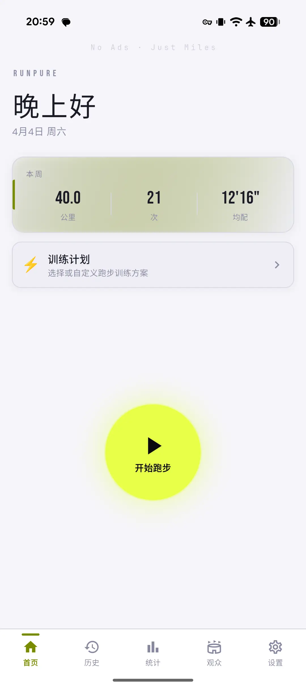
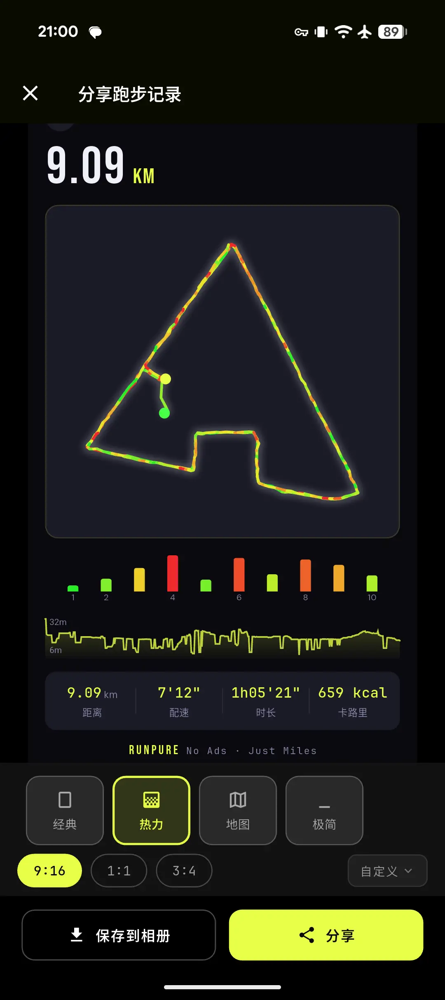
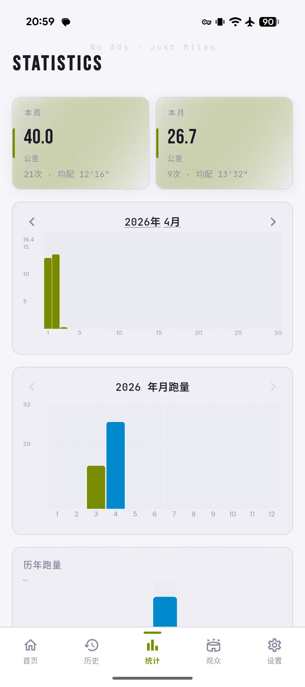
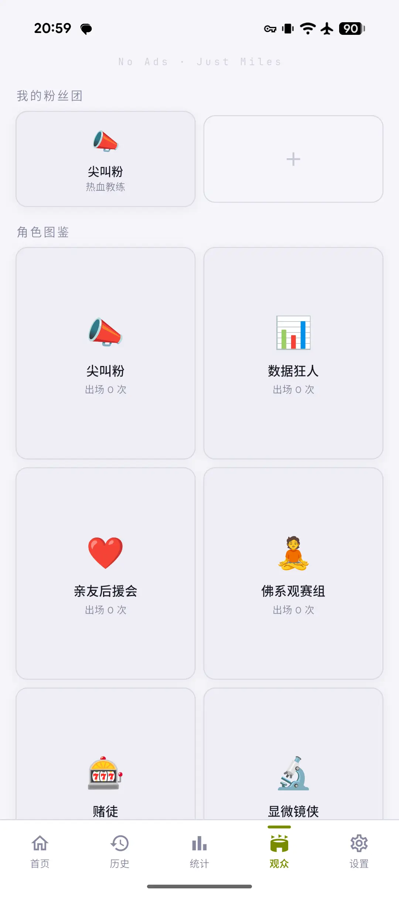
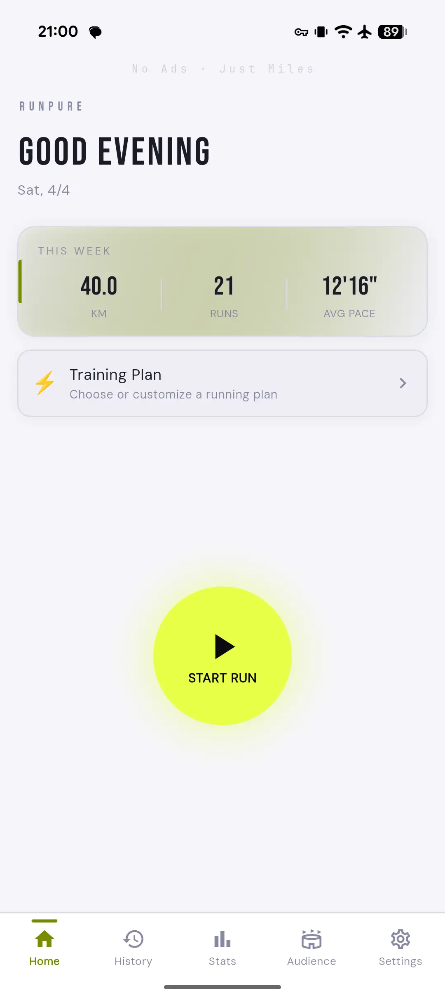
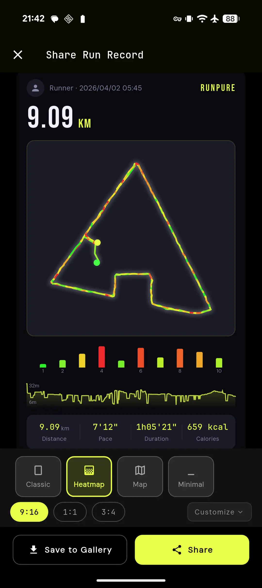
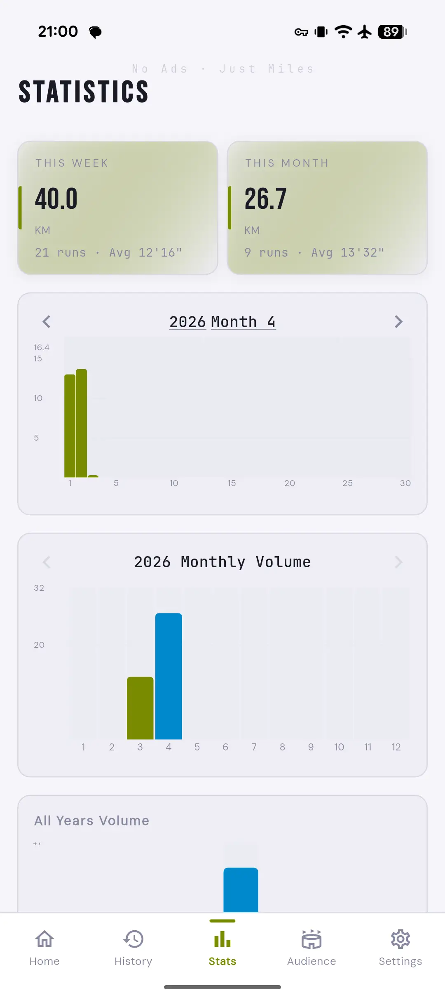
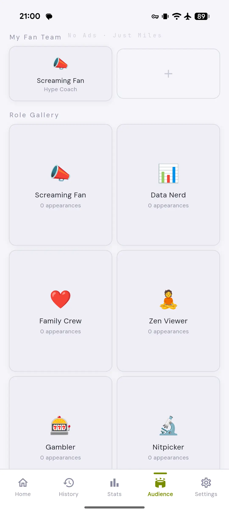

# Solrun

<p align="center"><strong>No Ads · Just Miles</strong></p>

<p align="center"><em>跑者可能孤单，但从不孤独。</em><br>
<em>Alone, not lonely. That's a runner.</em></p>

<p align="center">
<a href="#中文">中文</a> | <a href="#english">English</a>
</p>

---

<a id="中文"></a>

## 中文

纯本地、零广告的跑步记录 App。数据只属于跑者自己，界面只服务于跑步本身。

### 明确不做的事

- 心率 / 蓝牙设备接入
- 后端服务 / 用户账号
- 社交功能
- 广告 / 分析 SDK

### 功能亮点

- **GPS 精准记录** — Android 原生 ForegroundService 双栈定位，iOS 后台持续追踪
- **配速热力轨迹** — 实时配速颜色映射，HSL 色谱 16 级量化
- **分公里配速** — 30 秒滑动窗口平滑算法，自动分公里语音播报
- **海拔累计** — 中位数滤波 + 阈值去噪 + 趋势确认，过滤 GPS 海拔漂移
- **离线地图** — CartoDB / OSM / 高德多源瓦片，LRU 200MB 缓存离线可用
- **城市识别** — 高德 Web API 优先 + Nominatim 兜底，自动记录跑步城市和天气
- **分享卡片** — 4 种模板 × 3 种比例 × 7 个自定义开关，热力轨迹 + 地图底图 + 观众语录水印
- **AI 观众系统** — 7 角色 × 5 人格 = 35 种虚拟观众，跑步中实时喊话 + 赛后采访
- **AI 跑步总结** — 单次 / 周 / 月 / 年智能分析，中英双语
- **跑前心情** — 选择心情影响观众喊话风格，自动记忆上次选择
- **训练计划** — 预设 5K / 10K / 间歇模板 + 自定义
- **数据导入导出** — GPX / CSV / Garmin Connect / ZIP 批量导入导出
- **国际化** — 中文 / 英文双语（含 AI Prompt 双语），跟随系统自动切换
- **深色设计** — 精心调校的深色 / 浅色主题，WCAG AA 对比度标准

### 截图

<p align="center">
  
  
  
  
</p>

### 技术栈

| 类别 | 技术 |
|------|------|
| 框架 | Flutter 3.22+ (Dart) |
| 状态管理 | flutter_riverpod |
| 路由 | go_router |
| 数据库 | drift (SQLite ORM)，CASCADE DELETE + WAL 模式 |
| 地图 | flutter_map + OSM / CartoDB / 高德瓦片 |
| 图表 | fl_chart |
| 语音播报 | flutter_tts |
| AI 集成 | 通用 LLM Provider（Claude / OpenAI / 通义千问 / 智谱 / MiniMax / 自定义） |
| 安全存储 | flutter_secure_storage |
| 国际化 | Flutter l10n (ARB + gen-l10n) |

### 开始使用

**环境要求：**

- Flutter SDK 3.22+
- Android Studio / VS Code
- Android 8.0+ / iOS 13.0+

**安装：**

```bash
git clone https://github.com/spideryu7758/Solrun.git
cd Solrun
flutter pub get
flutter run
```

**常用命令：**

```bash
flutter pub get                              # 安装依赖
flutter run                                  # 运行
flutter test                                 # 测试（181 个用例）
flutter analyze                              # 静态分析
flutter build apk                            # 构建 Android APK
dart run build_runner build --delete-conflicting-outputs  # drift 代码生成
flutter gen-l10n                             # 国际化代码生成
```

### 项目结构

采用 **Feature-First 分层架构**（data / domain / presentation）：

```
lib/
├── app/              # 路由、主题、语言配置、底部导航壳
│   └── shell/        # MainShell + HomePage（从 router 拆分）
├── features/         # 功能模块
│   ├── tracking/     # 运动记录（GPS、配速、海拔、检查点）
│   ├── history/      # 历史记录（按月列表、详情、轨迹回放）
│   ├── stats/        # 统计图表（月/年/历年柱状图）
│   ├── training/     # 训练计划
│   ├── share/        # 分享卡片（4 模板 + 公用水印组件）
│   ├── audience/     # AI 观众系统（喊话 + 采访 + 角色图鉴）
│   ├── ai_summary/   # AI 跑步总结
│   ├── ai_settings/  # AI 服务配置
│   ├── settings/     # 设置（拆分为 5 个 section）
│   └── export/       # GPX / CSV / Garmin 导入导出
├── shared/           # 共享组件、工具函数、服务
│   └── services/llm/ # 通用 LLM Provider 层
├── data/             # 数据库定义、DAO、Provider（集中管理）
└── l10n/             # 国际化资源（中/英 ARB）
```

### 致谢

- [RunFlutterRun](https://github.com/BenjaminCanape/RunFlutterRun) — 项目灵感来源 (MIT License)

### AI 辅助开发

本项目开发过程中使用了以下 AI 代码模型辅助编写：

- [Claude](https://www.anthropic.com/claude) (Anthropic) — 架构设计、核心逻辑、功能实现、代码审查
- [GLM](https://www.zhipuai.cn) (智谱) — 功能实现、代码审查、调试优化
- [GPT](https://openai.com) (OpenAI) — 功能实现、代码审查、问题排查

### 开源协议

[MIT License](LICENSE)

---

<a id="english"></a>

## English

A fully local, zero-ad running tracker app. Your data belongs to you, and the interface serves only your run.

### Non-Goals

- Heart rate / Bluetooth device support
- Backend services / user accounts
- Social features
- Ads / analytics SDKs

### Features

- **Precise GPS Tracking** — Android native ForegroundService dual-stack positioning, iOS background tracking
- **Pace Heatmap Trail** — Real-time pace-to-color mapping with HSL 16-level quantized spectrum
- **Split Pace** — 30-second sliding window smoothing, automatic per-km voice announcements
- **Elevation Tracking** — Median filter + threshold denoising + trend confirmation
- **Offline Maps** — CartoDB / OSM / Amap multi-source tiles with 200MB LRU cache
- **City Recognition** — Amap Web API primary + Nominatim fallback, auto-records city and weather
- **Share Cards** — 4 templates × 3 aspect ratios × 7 toggles, heatmap trail + map overlay + audience quote watermark
- **AI Audience System** — 7 roles × 5 personalities = 35 virtual spectators with real-time shouts + post-run interviews
- **AI Run Summary** — Single run / weekly / monthly / yearly analysis, bilingual
- **Pre-run Mood** — Mood selection influences audience tone, auto-remembers last choice
- **Training Plans** — Preset 5K / 10K / interval templates + custom
- **Data Import/Export** — GPX / CSV / Garmin Connect / ZIP batch import and export
- **i18n** — Chinese / English bilingual (including AI prompts), auto-follows system language
- **Dark Design** — Carefully tuned dark / light themes, WCAG AA contrast compliance

### Screenshots

<p align="center">
  
  
  
  
</p>

### Tech Stack

| Category | Technology |
|----------|-----------|
| Framework | Flutter 3.22+ (Dart) |
| State Management | flutter_riverpod |
| Routing | go_router |
| Database | drift (SQLite ORM), CASCADE DELETE + WAL mode |
| Maps | flutter_map + OSM / CartoDB / Amap tiles |
| Charts | fl_chart |
| TTS | flutter_tts |
| AI Integration | Generic LLM Provider (Claude / OpenAI / Qwen / Zhipu / MiniMax / Custom) |
| Secure Storage | flutter_secure_storage |
| i18n | Flutter l10n (ARB + gen-l10n) |

### Getting Started

**Prerequisites:**

- Flutter SDK 3.22+
- Android Studio / VS Code
- Android 8.0+ / iOS 13.0+

**Install:**

```bash
git clone https://github.com/spideryu7758/Solrun.git
cd Solrun
flutter pub get
flutter run
```

**Common Commands:**

```bash
flutter pub get                              # Install dependencies
flutter run                                  # Run the app
flutter test                                 # Run tests (181 cases)
flutter analyze                              # Static analysis
flutter build apk                            # Build Android APK
dart run build_runner build --delete-conflicting-outputs  # drift code generation
flutter gen-l10n                             # Generate l10n files
```

### Project Structure

**Feature-First layered architecture** (data / domain / presentation):

```
lib/
├── app/              # Routing, theme, locale, bottom nav shell
│   └── shell/        # MainShell + HomePage (split from router)
├── features/         # Feature modules
│   ├── tracking/     # Run tracking (GPS, pace, elevation, checkpoints)
│   ├── history/      # Run history (monthly list, details, trajectory replay)
│   ├── stats/        # Statistics charts (month/year/all-years bar charts)
│   ├── training/     # Training plans
│   ├── share/        # Share cards (4 templates + shared watermark widget)
│   ├── audience/     # AI audience system (shouts + interviews + role gallery)
│   ├── ai_summary/   # AI run summary
│   ├── ai_settings/  # AI service configuration
│   ├── settings/     # Settings (split into 5 sections)
│   └── export/       # GPX / CSV / Garmin import & export
├── shared/           # Shared widgets, utils, services
│   └── services/llm/ # Generic LLM Provider layer
├── data/             # Database definitions, DAOs, providers (centralized)
└── l10n/             # i18n resources (Chinese / English ARB)
```

### Acknowledgements

- [RunFlutterRun](https://github.com/BenjaminCanape/RunFlutterRun) — Project inspiration (MIT License)

### AI-Assisted Development

This project was built with the assistance of the following AI coding models:

- [Claude](https://www.anthropic.com/claude) (Anthropic) — Architecture design, core logic, code review
- [GLM](https://www.zhipuai.cn) (Zhipu AI) — Feature implementation, debugging & optimization
- [GPT](https://openai.com) (OpenAI) — Feature implementation, troubleshooting

### License

[MIT License](LICENSE)
